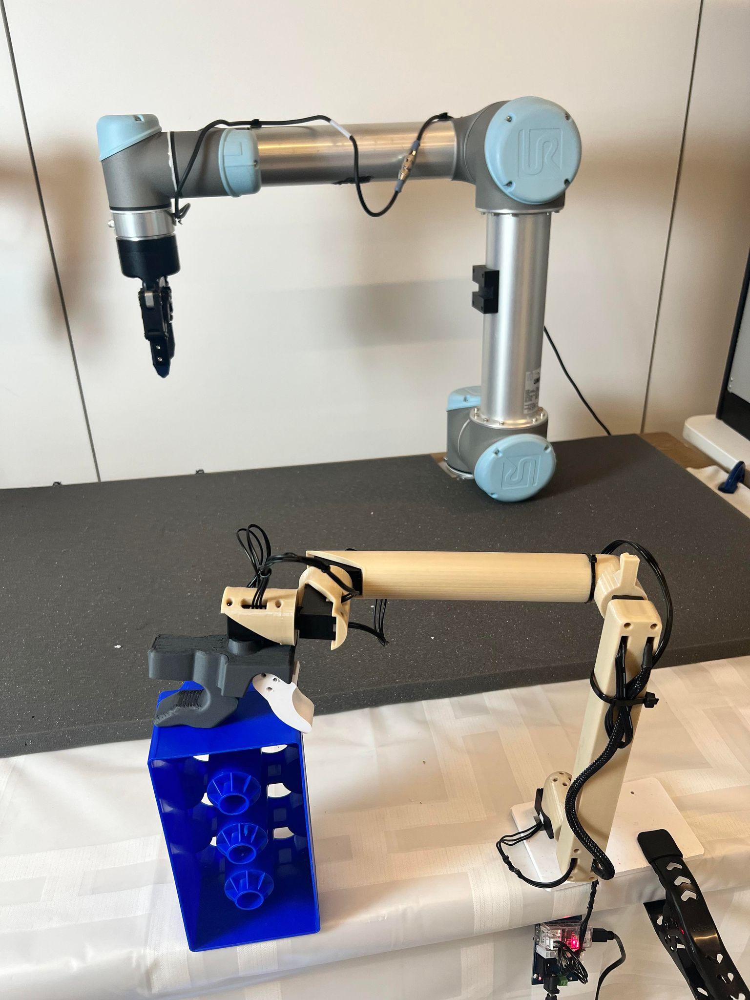
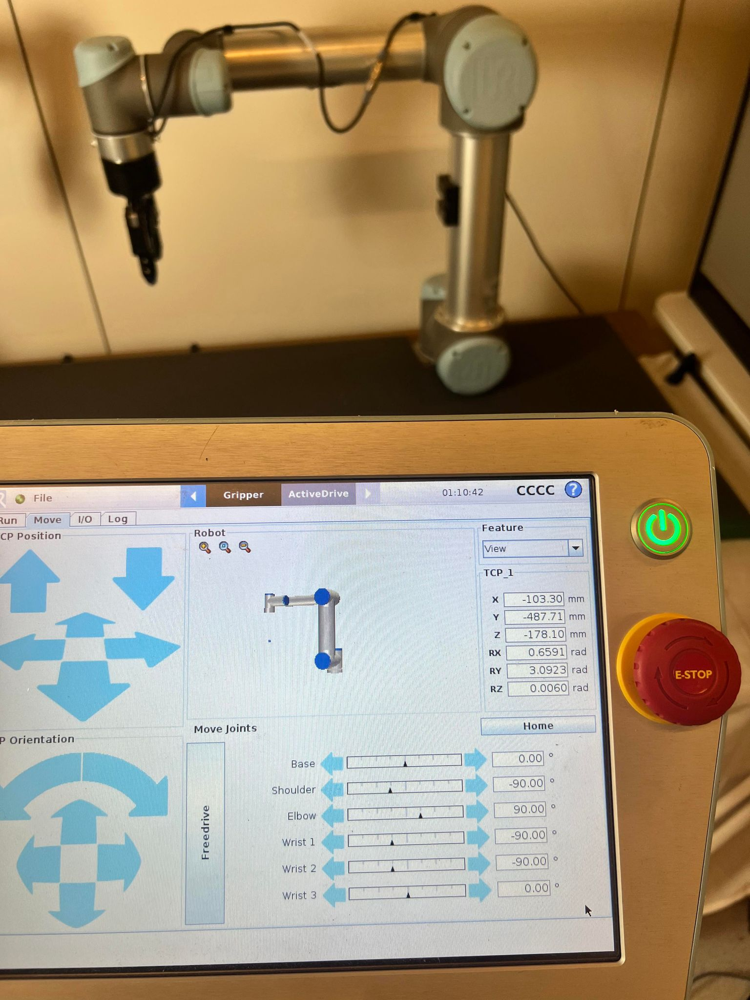

# GELLO
This is the central repo that holds the all the software for GELLO. See the website for the paper and other resources for GELLO https://wuphilipp.github.io/gello_site/
See the GELLO hardware repo for the STL files and hardware instructions for building your own GELLO https://github.com/wuphilipp/gello_mechanical
```
git clone https://github.com/ai4ce/ai4ce-gello-teleoperation.git
cd ai4ce-gello-teleoperation
```

<p align="center">
  
</p>


## Use your own environment
I like to manage environment with [uv](https://docs.astral.sh/uv/#highlights) nowadays, but conda and other venv management tool should work as well.
```

git submodule init
git submodule update # so you have all the submodule needed
uv sync # when using pip to install packages, do pip install -r pyproject.toml 
```

## Use with Docker
First install ```docker``` following this [link](https://docs.docker.com/engine/install/ubuntu/) on your host machine.
Then you can clone the repo and build the corresponding docker environment

Build the docker image and tag it as gello:latest. If you are going to name it differently, you need to change the launch.py image name
```
docker build . -t gello:latest
```

We have provided an entry point into the docker container
```
python scripts/launch.py
```

# GELLO configuration setup (PLEASE READ)
Now that you have downloaded the code, there is some additional preparation work to properly configure the Dynamixels and GELLO.
These instructions will guide you on how to update the motor ids of the Dynamixels and then how to extract the joint offsets to configure your GELLO.

## Update motor IDs
Install the [dynamixel_wizard](https://emanual.robotis.com/docs/en/software/dynamixel/dynamixel_wizard2/).
By default, each motor has the ID 1. In order for multiple dynamixels to be controlled by the same U2D2 controller board, each dynamixel must have a unique ID.
This process must be done one motor at a time. Connect each motor, starting from the base motor, and assign them in increasing order until you reach the gripper.

Steps:
 * Connect a single motor to the controller and connect the controller to the computer.
 * Open the dynamixel wizard
 * Click scan (found at the top left corner), this should detect the dynamixel. Connect to the motor
 * Look for the ID address and change the ID to the appropriate number.
 * Repeat for each motor

## Create the GELLO configuration and determining joint ID's
After the motor ID's are set, we can now connect to the GELLO controller device. However each motor has its own joint offset, which will result in a joint offset between GELLO and your actual robot arm.
Dynamixels have a symmetric 4 hole pattern which means there the joint offset is a multiple of pi/2.
The `GelloAgent` class  accepts a `DynamixelRobotConfig` (found in `gello/agents/gello_agent.py`). The Dynamixel config specifies the parameters you need to find to operate your GELLO. Look at the documentation for more details.

We have created a simple script to automatically detect the joint offset:
* set GELLO into a known configuration, where you know what the corresponding joint angles should be. For example, we set out GELLO in this configuration, where we know the desired ground truth joints. (0, -90, 90, -90, -90, 0)
<p align="center">
  
  
</p>

* run 
```
python scripts/gello_get_offset.py \
    --start-joints 0 -1.57 1.57 -1.57 -1.57 0 \ # in radians
    --joint-signs 1 1 -1 1 1 1 \
    --port /dev/serial/by-id/usb-FTDI_USB__-__Serial_Converter_FT7WBG6
# replace values with your own
```
* Use the known starting joints for `start-joints`.
* Use the `joint-signs` for your own robot (see below).
* Use your serial port for `port`. You can find the port id of your U2D2 Dynamixel device by running `ls /dev/serial/by-id` and looking for the path that starts with `usb-FTDI_USB__-__Serial_Converter` (on Ubuntu). On Mac, look in /dev/ and the device that starts with `cu.usbserial`

`joint-signs` for each robot type:
* UR: `1 1 -1 1 1 1`
* Panda: `1 -1 1 1 1 -1 1`
* xArm: `1 1 1 1 1 1 1`

The script prints out a list of joint offsets. Go to `gello/agents/gello_agent.py` and add a DynamixelRobotConfig to the PORT_CONFIG_MAP. You are now ready to run your GELLO!

# Using GELLO to control a robot!

The code provided here is simple and only relies on python packages. The code does NOT use ROS, but a ROS wrapper can easily be adapted from this code.
For multiprocessing, we leverage [ZMQ](https://zeromq.org/)

## Testing in sim
First test your GELLO with a simulated robot to make sure that the joint angles match as expected.
In one terminal run
```
python experiments/launch_nodes.py --robot <sim_ur, sim_panda, or sim_xarm>
```
This launched the robot node. A simulated robot using the mujoco viewer should appear.

Then, launch your GELLO (the controller node).
```
python experiments/run_env.py --agent=gello
```
You should be able to use GELLO to control the simulated robot!

## Running on a real robot.
Once you have verified that your GELLO is properly configured, you can test it on a real robot!

Before you run with the real robot, you will have to install a robot specific python package.
The supported robots are in `gello/robots`.
 * UR: [ur_rtde](https://sdurobotics.gitlab.io/ur_rtde/installation/installation.html)
 * panda: [polymetis](https://facebookresearch.github.io/fairo/polymetis/installation.html). If you use a different framework to control the panda, the code is easy to adpot. See/Modify `gello/robots/panda.py`
 * xArm: [xArm python SDK](https://github.com/xArm-Developer/xArm-Python-SDK)

```
# Launch all of the node
python experiments/launch_nodes.py --robot=<your robot>
# run the enviroment loop
python experiments/run_env.py --agent=gello
```

Ideally you can start your GELLO near a known configuration each time. If this is possible, you can set the `--start-joint` flag with GELLO's known starting configuration. This also enables the robot to reset before you begin teleoperation.

## Collect data
We have provided a simple example for collecting data with gello.
To save trajectories with the keyboard, add the following flag `--use-save-interface`

Data can then be processed using the demo_to_gdict script.
```
python gello/data_utils/demo_to_gdict.py --source-dir=<source dir location>
```

## Running a bimanual system with GELLO
GELLO also be used in bimanual configurations.
For an example, see the `bimanual_ur` robot in `launch_nodes.py` and `--bimanual` flag in the `run_env.py` script.

## Notes
Due to the use of multiprocessing, sometimes python process are not killed properly. We have provided the kill_nodes script which will kill the
python processes.
```
./kill_nodes.sh
```

### Using a new robot!
If you want to use a new robot you need a GELLO that is compatible. If the kiniamtics are close enough, you may directly use an existing GELLO. Otherwise you will have to design your own.
To add a new robot, simply implement the `Robot` protocol found in `gello/robots/robot`. See `gello/robots/panda.py`, `gello/robots/ur.py`, `gello/robots/xarm_robot.py` for examples.

### Contributing
Please make a PR if you would like to contribute! The goal of this project is to enable more accessible and higher quality teleoperation devices and we would love your input!

You can optionally install some dev packages.
```
pip install -r requirements_dev.txt
```

The code is organized as follows:
 * `scripts`: contains some helpful python `scripts`
 * `experiments`: contains entrypoints into the gello code
 * `gello`: contains all of the `gello` python package code
    * `agents`: teleoperation agents
    * `cameras`: code to interface with camera hardware
    * `data_utils`: data processing utils. used for imitation learning
    * `dm_control_tasks`: dm_control utils to build a simple dm_control enviroment. used for demos
    * `dynamixel`: code to interface with the dynamixel hardware
    * `robots`: robot specific interfaces
    * `zmq_core`: zmq utilities for enabling a multi node system


This code base uses `isort` and `black` for code formatting.
pre-commits hooks are great. This will automatically do some checking/formatting. To use the pre-commit hooks, run the following:
```
pip install pre-commit
pre-commit install
```

# Citation

```
@misc{wu2023gello,
    title={GELLO: A General, Low-Cost, and Intuitive Teleoperation Framework for Robot Manipulators},
    author={Philipp Wu and Yide Shentu and Zhongke Yi and Xingyu Lin and Pieter Abbeel},
    year={2023},
}
```

# License & Acknowledgements
This source code is licensed under the MIT license found in the LICENSE file. in the root directory of this source tree.

This project builds on top of or utilizes the following third party dependencies.
 * [google-deepmind/mujoco_menagerie](https://github.com/google-deepmind/mujoco_menagerie): Prebuilt robot models for mujoco
 * [brentyi/tyro](https://github.com/brentyi/tyro): Argument parsing and configuration
 * [ZMQ](https://zeromq.org/): Enables easy create of node like processes in python.
# ai4ce-gello-teleoperation-vla


使用mujoco仿真采集数据：
 ‘’‘
 python experiments/launch_nodes.py --robot sim_ur_cube
 python experiments/run_env.py --agent=gello --use_save_interface
 ‘’‘
 → 用 gello 手柄控制机械臂，键盘操作：

S — 开始记录一个 episode
Q — 停止记录，保存到 ./bc_data/pick_cube/
Ctrl+C — 退出

显示相机视角：
实时显示 OpenCV 窗口（查看 offscreen 渲染画面）
新开一个终端，运行以下脚本：
cd /home/alan/ai4ce-gello-teleoperation-vla
python -c "
import pickle, zmq, cv2, numpy as np

ctx = zmq.Context()
sock = ctx.socket(zmq.REQ)
sock.connect('tcp://127.0.0.1:6001')

while True:
    sock.send(pickle.dumps({'method': 'get_observations', 'args': {}}))
    obs = pickle.loads(sock.recv())
    base = obs.get('base_rgb')
    wrist = obs.get('wrist_rgb')
    if base is not None:
        cv2.imshow('base_cam', cv2.cvtColor(base, cv2.COLOR_RGB2BGR))
    if wrist is not None and wrist.any():
        cv2.imshow('wrist_cam', cv2.cvtColor(wrist, cv2.COLOR_RGB2BGR))
    if cv2.waitKey(30) == ord('q'):
        break

cv2.destroyAllWindows()
sock.close()
"

（可选）终端 3 — 采集完后转换为 zarr 格式


python gello/data_utils/gello_diffusion.py
→ 生成 ./bc_data/pick_cube.zarr，可直接用于 diffusion policy 训练

录制数据结构：
joint_positions	(7,) float	当前 6 臂关节角 + 1 夹爪角（rad）
joint_velocities	(7,) float	关节速度
ee_pos_quat	(7,) float	末端位置 xyz + 四元数 wxyz
gripper_position	scalar	夹爪开合量
cube_pos	(3,) float	立方体世界坐标 xyz
cube_quat	(4,) float	立方体姿态四元数
goal_pos	(3,) float	放置区中心坐标（固定值）
base_rgb	(480,640,3) uint8	基础相机 RGB 图像
base_depth	(480,640) float32	深度图（米）
wrist_rgb	(480,640,3) uint8	腕部相机 RGB 图像
wrist_depth	(480,640) float32	腕部深度图
control	(7,) float	agent 发出的动作指令（6 臂 + 1 夹爪）

检查数据内容：
python -c "
import pickle, glob, numpy as np
from pathlib import Path
# 找最新一条 episode 的第一帧
pkls = sorted(Path('./bc_data/none').rglob('*.pkl'))
print(f'共 {len(pkls)} 帧')

with open(pkls[0], 'rb') as f:
    frame = pickle.load(f)

for k, v in frame.items():
    if isinstance(v, np.ndarray):
        print(f'  {k}: shape={v.shape}, dtype={v.dtype}')
    else:
        print(f'  {k}: {v}')
"